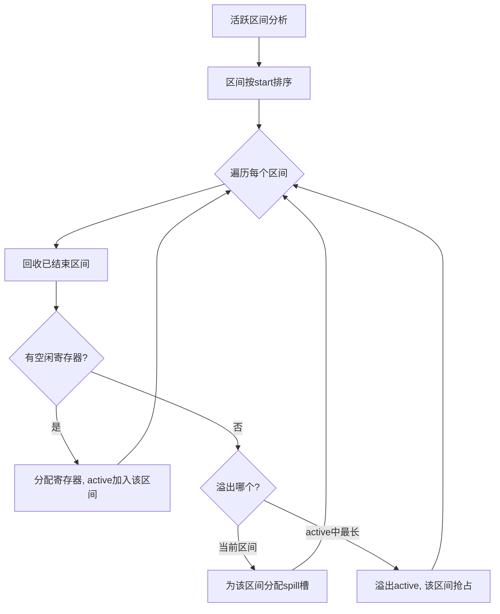

# 线性扫描寄存器分配

```mermaid

flowchart TD
    A[活跃区间分析] --> B[区间按start排序]
    B --> C{遍历每个区间}
    C --> D[回收已结束区间]
    D --> E{有空闲寄存器?}
    E -- 是 --> F[分配寄存器, active加入该区间]
    E -- 否 --> G{溢出哪个?}
    G -- 当前区间 --> H[为该区间分配spill槽]
    G -- active中最长 --> I[溢出active, 该区间抢占]
    F & H & I --> C
```
